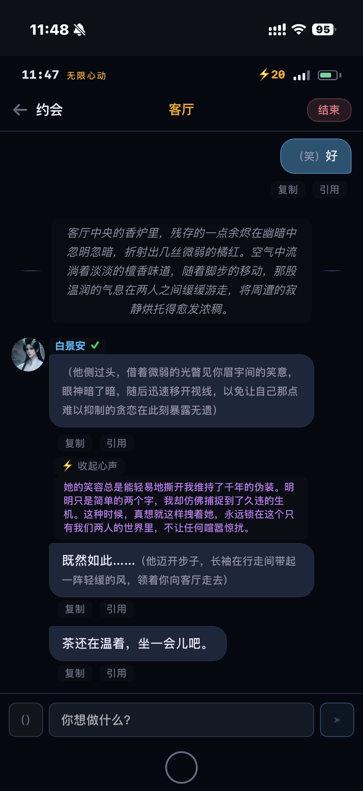
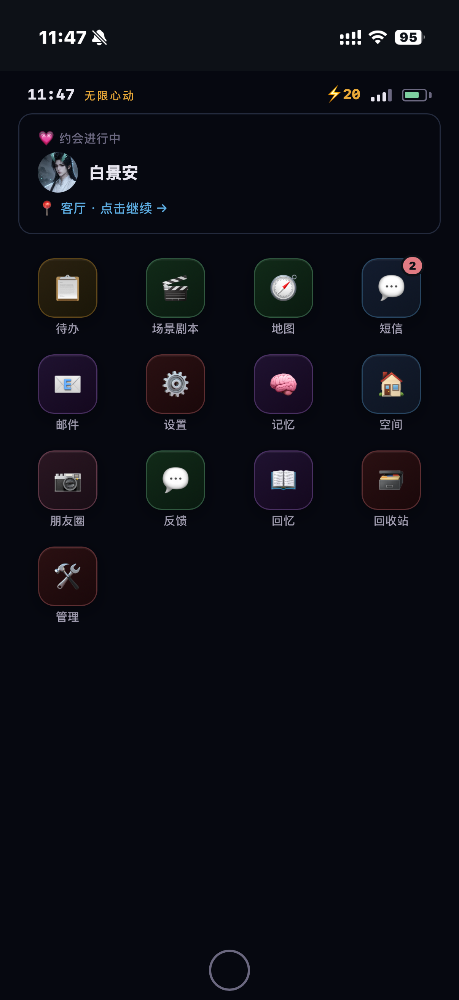
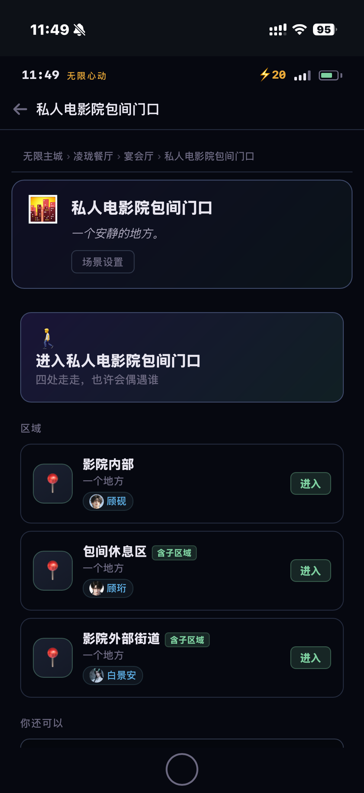
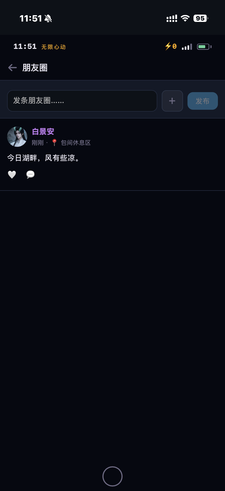

# 无限心动（infinite-date）

无限流世界观驱动的多人联机 AI 约会模拟器。玩家通过引导式对话创建想攻略的角色，并与角色进行短信、约会、朋友圈互动与剧本角色扮演等。角色可以是全局共享的（公共态）、个人魔改的（override 私有态）、或完全私密的（完全私有态）。

灵感来自 [Heartmorrow](https://github.com/HMDSimDev/heartmorrow)——一个本地优先的 AI 约会模拟器。本项目借鉴了其「本地运行 + 角色驱动 + 模型即声音」的核心理念，在设计方向和技术实现上独立演进。

项目代码由 [Hermes Agent](https://hermes-agent.nousresearch.com)（Nous Research 的 AI 编程助手）完成，人类负责设计决策、需求定义和质量验收。

详细设计见 [DESIGN.md](./DESIGN.md)。

手机端截图：

| 约会 | 首页 | 地图 | 短信 | 朋友圈 |
|---|---|---|---|---|
|  |  |  |  |  |

---

## 技术栈

| 层 | 技术 | 说明 |
|---|---|---|
| 后端 | Fastify 5 + TypeScript + tsx | Node 22+，tsx watch 热重载 |
| 数据库 | node:sqlite（内置） | 零原生依赖，WAL 模式，FK 级联删除 |
| 前端 | React 18 + Vite 6 | 手机 UI 适配，暗色主题 |
| LLM | vLLM（OpenAI 兼容 API） | Gemma-4-26B-A4B-it，guided_json 结构化输出，多模态图文 |
| 向量检索 | bge-base-zh-v1.5 | 768 维语义检索，跨场记忆累积 |
| 包管理 | pnpm workspace | monorepo: server / web / shared |

---

## 核心特性

- **引导式角色创建**：多轮 AI 对话 + MediaWiki 联网搜索真实角色资料，不用 LLM 训练知识填充
- **多角色场景引擎**：逐拍点名 → 演员生成台词/旁白 → 数值结算
- **三层记忆系统**：热窗（近 N 轮原文）→ 中期折叠（LLM 总结）→ 长期总览 + 跨场语义检索（bge-base-zh）
- **角色主动消息**：意愿累积机制（sms_urge / moment_urge），行程变更时摇骰子触发，不依赖玩家在线
- **角色行程系统**：确定性 hash + 性格模板池，LLM 可覆盖调整，落库保证一致性
- **剧本系统**：玩家自创剧本 + roll 字段 + 数值系统 + 梦境回写记忆
- **三种角色形态**：公共态 / override 私有态（fork 完整角色卡）/ 完全私有态
- **多模态**：图片发送（短信/约会/朋友圈），角色通过 vLLM 多模态能力「看到」图片
- **手机 UI**：暗色主题、打字机动画、桌面图标、摸鱼模式（伪装 AI 助手）

---

## 快速开始

### 前置条件

- Node.js 22+（内置 `node:sqlite`）
- pnpm 9+
- 一个 OpenAI 兼容的 LLM endpoint（vLLM / Ollama / LM Studio 等）

### 安装

```bash
git clone <repo-url>
cd infinite-date
pnpm install
```

### 配置

```bash
cp .env.example .env
# 编辑 .env 填写你的 LLM endpoint 和 API key
```

### 启动

```bash
# 后端（3000 端口，热重载）
cd apps/server && pnpm dev

# 前端（8080 端口）
cd apps/web && pnpm dev

# 或一起启动
pnpm dev
```

打开 `http://localhost:8080`，使用任意邀请码注册（首次运行会自动创建管理员邀请码）。

### 环境变量

| 变量 | 默认值 | 说明 |
|---|---|---|
| `HOST` | `0.0.0.0` | 后端监听地址 |
| `PORT` | `3000` | 后端端口 |
| `LLM_BASE_URL` | `http://127.0.0.1:8000/v1` | LLM endpoint |
| `LLM_API_KEY` | — | LLM API key |
| `LLM_MODEL` | `gemma-4-26b` | 模型名 |
| `CORS_ORIGINS` | `localhost:8080,5173` | CORS 白名单 |
| `IDATE_DATA_DIR` | `./data` | 数据目录 |

---

## 项目结构

```
infinite-date/
├── DESIGN.md                 # 设计文档（完整设计决策）
├── LICENSE                   # The Unlicense（公共领域）
├── .env.example              # 环境变量模板
├── docs/
│   ├── CODE_MAP.md           # 代码地图（文件→职责→导出函数）
│   ├── DATA_MODEL.md         # 数据模型（全表定义 + migration 日志）
│   ├── PROMPTS.md            # Prompt 模板设计说明
│   └── OPEN_QUESTIONS.md     # 未解决设计问题
├── packages/
│   └── shared/               # 前后端共享类型
├── apps/
│   ├── server/               # 后端
│   │   └── src/
│   │       ├── index.ts      # Fastify 入口
│   │       ├── config.ts     # 配置
│   │       ├── db/           # schema + migration
│   │       ├── routes/       # API 路由
│   │       ├── lib/          # 核心逻辑（场景引擎/记忆/行程/主动消息…）
│   │       ├── llm/          # LLM 适配器
│   │       └── prompt/       # Prompt 模板（.txt 文件，改文件即改 prompt）
│   └── web/                  # 前端
│       └── src/
│           ├── App.tsx       # 路由控制（View 状态机）
│           ├── pages/        # 页面组件
│           ├── components/   # 通用组件
│           └── lib/          # API 客户端 + 工具
└── pnpm-workspace.yaml
```

---

## 架构概览

```
玩家浏览器（8080）
    │
    ├── Vite dev server ──proxy /api──▶ Fastify（3000）
    │                                      │
    │                                      ├── SQLite（node:sqlite，WAL，FK 级联）
    │                                      │
    │                                      ├── 场景引擎（点名版）
    │                                      │   ├── 逐拍点名 → 演员生成台词/旁白
    │                                      │   ├── 数值 & 气氛判定
    │                                      │   └── 跨轮复述检测
    │                                      │
    │                                      ├── 三层记忆
    │                                      │   ├── 热窗（近 N 轮原文）
    │                                      │   ├── 中期折叠（LLM 总结 + 玩家事实提取）
    │                                      │   ├── 长期总览（跨场累积）
    │                                      │   └── 语义检索（bge-base-zh，三路分开搜）
    │                                      │
    │                                      ├── 角色行程（hash + 性格模板池 + LLM 覆盖）
    │                                      ├── 角色主动消息（意愿累积 + 行程变更触发）
    │                                      └── Prompt 模板（.txt 文件外部化，改文件即改 prompt）
    │
    ├── Embedding 服务（8001）
    │   └── bge-base-zh-v1.5（768 维）
    │
    └── vLLM（8000）
        └── Gemma-4-26B-A4B-it
```

---

## 许可证

[The Unlicense](./LICENSE)——可修改、可商用、可二次发布，无需署名。

---

## Roadmap

以下功能在 DESIGN.md 中有设计，尚未实现：

- **世界任务**：LLM 生成原创世界 + 执念物品 + 地标 + 角色，玩家带好友角色同行完成任务
- **角色任务**：基于角色里程碑生成过去场景，玩家与镜像版角色互动，结束后梦境回写记忆
- **邀请任务**：角色主动邀请，基于角色特长的温馨向任务
- **货币系统**：当前权限钱包已实现（余额/消耗/发放/交易记录），但尚未与任务奖励打通，数值待实测后确定
- **角色放逐**：per-instance 删除（区别于删好友的 per-character 删除），设计已有，实现待定

已实现的核心循环：角色创建 → 约会 → 短信 → 记忆 → 主动消息 → 朋友圈 → 剧本系统。

---

## 致谢

- [Heartmorrow](https://github.com/HMDSimDev/heartmorrow)——灵感来源，本地优先的 AI 约会模拟器
- [Hermes Agent](https://hermes-agent.nousresearch.com)（Nous Research）——全部代码由 Hermes 编写
- [Gemma](https://ai.google.dev/gemma)——Google 的开源大语言模型，本项目的默认 LLM
- [bge-base-zh](https://huggingface.co/BAAI/bge-base-zh-v1.5)——中文语义检索嵌入模型
- 测试群的小姐妹们——在联机测试过程中提供了许多非常好的建议
